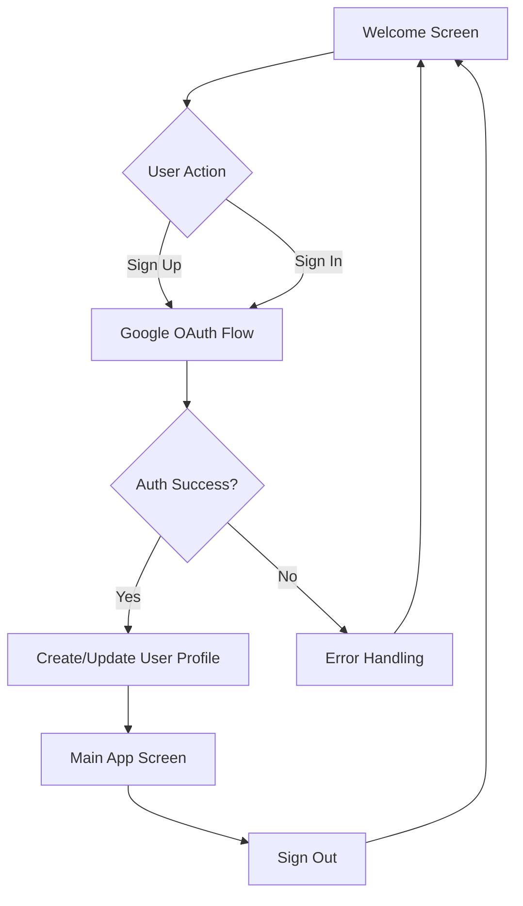
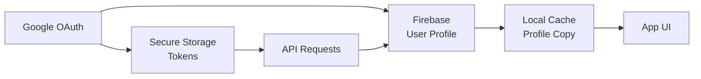

# Design Document

## Overview

The Puck Buddy authentication system will provide a secure, kid-friendly entry point to the hockey learning app. The design emphasizes simplicity, visual appeal, and security while maintaining compliance with children's privacy regulations. The system will use Google OAuth for authentication, leveraging the `@react-native-google-signin/google-signin` library for native integration across iOS and Android platforms.

## Architecture

### High-Level Architecture



### Authentication Flow

1. **Initial Load**: Check for existing authentication state
2. **Welcome Screen**: Display if not authenticated
3. **Google OAuth**: Handle sign-up/sign-in through Google
4. **Profile Management**: Create or retrieve user profile
5. **Session Management**: Maintain authentication state
6. **Secure Storage**: Store tokens securely

## Components and Interfaces

### Screen Components

#### WelcomeScreen
- **Purpose**: Entry point with branding and authentication options
- **Props**: None (root screen)
- **State**: Loading state, error messages
- **Key Features**:
  - Hockey-themed background with ice rink imagery
  - Large, friendly "Puck Buddy" logo with hockey stick and puck
  - Bright, contrasting buttons for accessibility
  - Fun tagline: "Learn Hockey, Have Fun!"

#### AuthButton
- **Purpose**: Reusable Google authentication button
- **Props**: `type: 'signin' | 'signup'`, `onPress: () => void`, `disabled: boolean`
- **State**: Loading state during authentication
- **Design**: 
  - Google branding guidelines compliance
  - Large touch targets (minimum 44px)
  - Clear visual feedback on press

### Service Layer

#### AuthService
```typescript
interface AuthService {
  signInWithGoogle(): Promise<AuthResult>
  signUpWithGoogle(): Promise<AuthResult>
  signOut(): Promise<void>
  getCurrentUser(): Promise<User | null>
  isAuthenticated(): boolean
}

interface AuthResult {
  success: boolean
  user?: User
  error?: string
}

interface User {
  id: string
  email: string
  name: string
  profilePicture?: string
  createdAt: Date
}
```

#### StorageService
```typescript
interface StorageService {
  // Secure storage for authentication tokens
  storeAuthToken(token: string): Promise<void>
  getAuthToken(): Promise<string | null>
  clearAuthData(): Promise<void>
  
  // Local storage for user profile cache
  storeUserProfile(user: User): Promise<void>
  getUserProfile(): Promise<User | null>
}
```

#### DataService
```typescript
interface DataService {
  // Remote storage for persistent user data
  createUserProfile(profile: UserProfile): Promise<UserProfile>
  updateUserProfile(id: string, updates: Partial<UserProfile>): Promise<UserProfile>
  getUserProfile(id: string): Promise<UserProfile | null>
  deleteUserProfile(id: string): Promise<void>
}
```

## Data Storage Strategy

### Storage Layers

1. **Secure Local Storage (Expo SecureStore)**
   - Authentication tokens and refresh tokens
   - Sensitive user credentials
   - Encrypted on device, not accessible to other apps

2. **Local Cache Storage (AsyncStorage)**
   - User profile information for offline access
   - App preferences and settings
   - Non-sensitive data that improves performance

3. **Remote Database (Firebase Firestore)**
   - Persistent user profiles and progress data
   - Cross-device synchronization
   - Backup and recovery capabilities
   - Real-time updates and offline support

### Data Flow


### Storage Implementation
- **Authentication**: Expo SecureStore for tokens, Firebase Auth for user management
- **User Data**: Firebase Firestore for persistence, AsyncStorage for caching
- **Offline Support**: Local cache allows app to work without internet
- **Sync Strategy**: Automatic sync when online, conflict resolution for offline changes

## Data Models

### User Profile
```typescript
interface UserProfile {
  id: string
  googleId: string
  email: string
  name: string
  profilePicture?: string
  createdAt: Date
  lastLoginAt: Date
  preferences: {
    theme: 'light' | 'dark'
    notifications: boolean
  }
}
```

### Authentication State
```typescript
interface AuthState {
  isAuthenticated: boolean
  isLoading: boolean
  user: UserProfile | null
  error: string | null
}
```

## Error Handling

### Error Categories

1. **Network Errors**: No internet connection, timeout
2. **Authentication Errors**: Invalid credentials, cancelled flow
3. **Permission Errors**: Google account access denied
4. **Configuration Errors**: Missing API keys, invalid setup

### Error Display Strategy

- **Kid-Friendly Messages**: Use simple, non-technical language
- **Visual Indicators**: Icons and colors to communicate status
- **Retry Mechanisms**: Clear options to try again
- **Parent Guidance**: Contact information for technical issues

### Error Messages
```typescript
const ERROR_MESSAGES = {
  NETWORK_ERROR: "Oops! Check your internet connection and try again.",
  AUTH_CANCELLED: "No worries! You can try signing in again anytime.",
  AUTH_FAILED: "Something went wrong. Let's try that again!",
  PERMISSION_DENIED: "We need permission to sign you in with Google.",
  UNKNOWN_ERROR: "Something unexpected happened. Please try again!"
}
```

## Testing Strategy

### Unit Testing
- **AuthService**: Mock Google Sign-In responses
- **StorageService**: Test secure storage operations
- **Components**: Test rendering and user interactions
- **Error Handling**: Verify error states and messages

### Integration Testing
- **Authentication Flow**: End-to-end sign-up/sign-in process
- **Cross-Platform**: iOS and Android compatibility
- **Network Conditions**: Offline/online state handling
- **Security**: Token storage and retrieval

### User Testing
- **Kid Usability**: Age-appropriate interface testing
- **Parent Approval**: Security and privacy validation
- **Accessibility**: Screen reader and motor accessibility
- **Performance**: Load times and responsiveness

## Security Considerations

### Privacy Compliance
- **COPPA Compliance**: Children's Online Privacy Protection Act
- **Minimal Data Collection**: Only necessary profile information
- **Parental Consent**: Clear privacy policy and terms
- **Data Retention**: Automatic cleanup of unused accounts

### Technical Security
- **Secure Storage**: Use Expo SecureStore for tokens
- **Token Management**: Automatic refresh and expiration
- **HTTPS Only**: All network communications encrypted
- **Input Validation**: Sanitize all user inputs
- **Firebase Security**: Firestore security rules to protect user data
- **Data Encryption**: All data encrypted in transit and at rest

### Google OAuth Security
- **PKCE Flow**: Proof Key for Code Exchange implementation
- **Scope Limitation**: Request minimal necessary permissions
- **State Validation**: Prevent CSRF attacks
- **Redirect URI Validation**: Secure callback handling

## Visual Design System

### Color Palette
- **Primary**: Hockey blue (#1E3A8A) - trust and reliability
- **Secondary**: Ice white (#F8FAFC) - clean and fresh
- **Accent**: Puck orange (#F97316) - energy and fun
- **Success**: Goal green (#10B981) - positive feedback
- **Error**: Penalty red (#EF4444) - clear warnings

### Typography
- **Headers**: Bold, rounded fonts (Nunito Bold)
- **Body**: Clear, readable fonts (Nunito Regular)
- **Buttons**: Medium weight for emphasis (Nunito SemiBold)
- **Size Scale**: Large text for young readers (minimum 16px)

### Iconography
- **Hockey Theme**: Pucks, sticks, goals, ice skates
- **Simple Shapes**: Easy recognition for children
- **Consistent Style**: Outlined icons with rounded corners
- **High Contrast**: Clear visibility on all backgrounds

### Layout Principles
- **Large Touch Targets**: Minimum 44px for easy tapping
- **Generous Spacing**: Prevent accidental touches
- **Clear Hierarchy**: Important elements stand out
- **Responsive Design**: Works on all screen sizes